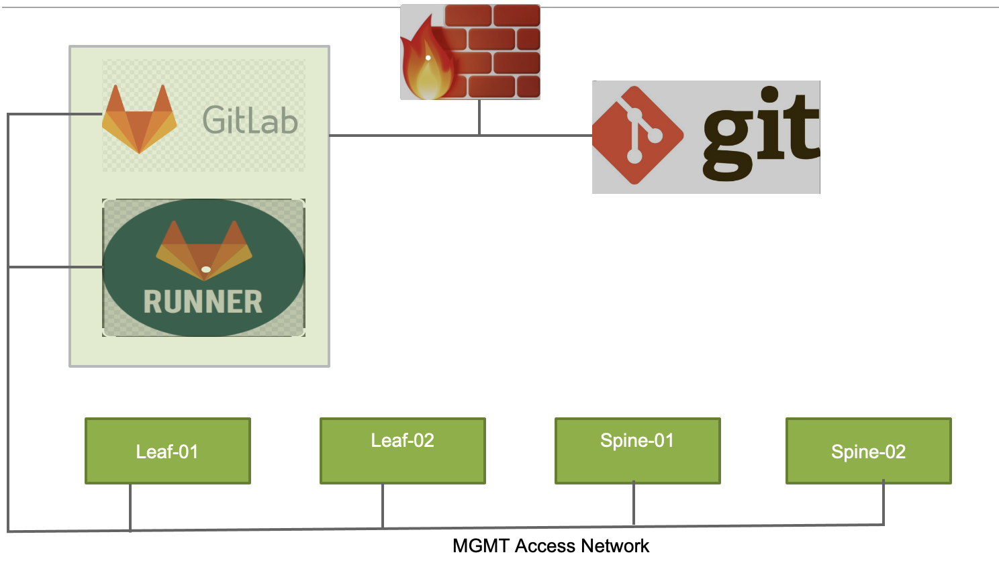

#  Junos IP Fabric (EVPN-VxLAN) Automation with Ansible and Gitlab CI/CD Pipeline

* My  Ansible project for Junos IP-Fabric config and mgmt operations is available at [ansible-junos-evpn-vxlan](https://github.com/kashif-nawaz/ansible-junos-evpn-vxlan).
* I have also described in detail how to setup a local instance of Gitlab, Setting up Gitlab-runner with docker-executor and its integration with a local Gitlab instance [Gitlabsetup] (https://github.com/kashif-nawaz/gitlabsetup-).
* This wiki is describing how to setup Gitlab CI/CD to automate Junos IP-Fabric.
## Creating a Docker Image 
* Hence, I am using docker-executor in Gitlab runner, so I need to build a docker image which will be used to run CI/CD jobs.
* Because my original ansible-junos-evpn-vxlan project was tested with these packages, I used a Centos:7 base image, Python 2.7, and Ansible 2.8.3. Ideally, I should have used the latest Centos/Ubuntu and Python3 (I will give it a try at some later time).
```
cat << EOF > Dockerfile 
#Download base image Centos7
FROM centos:7
RUN yum  -y update
RUN yum install -y openssh-clients vim
RUN yum -y install https://packages.endpointdev.com/rhel/7/os/x86_64/endpoint-repo.x86_64.rpm
RUN yum install git -y
RUN curl "https://bootstrap.pypa.io/pip/2.7/get-pip.py" -o get-pip.py
RUN python get-pip.py
RUN pip install --upgrade pip
RUN pip install --upgrade setuptools
RUN yum install python-devel libxml2-devel libxslt-devel gcc openssl libffi-devel -y
RUN pip install ansible==2.8.3
RUN pip install junos-eznc
RUN pip install jinja2
RUN pip install jxmlease
RUN ansible-galaxy install Juniper.junos
WORKDIR /root/
CMD ["/bin/bash"]
EOF

docker build -t centos7:junos-atomation2.7-v2 . 
Successfully built 2dff8e2c18a0
Successfully tagged centos:7
docker tag 2dff8e2c18a0  gitlab.knawaz.lab.jnpr:5050/knawaz/junos-automation/centos7:junos-automation2.7-v2

In the above URL (gitlab.knawaz.lab.jnpr is my Gitlab server DNS entry, 5050 is the port where Docker Registry is listening, knawaz is my user, junos-automation depicts my project name, and centos7:junos-automation2.7-v2 is the container image tag). 

docker push gitlab.knawaz.lab.jnpr:5050/knawaz/junos-automation/centos7:junos-automation2.7-v2
```
* Once a docker image is pushed into the Gitlab docker registry , then it's ready for usage in the Gitlab CI/CD pipeline.

## Using [SSH keys](https://docs.gitlab.com/ee/ci/ssh_keys/) with GitLab CI/CD 
* Gitlab runner (e.g docker-executor) needs to access managed devices via ssh (e.g. IP-Fabric spine and leaf devices) for config tasks.
* To meet above requirement ssh public should have been added in spine and leaf devices and corresponding ssh pvt needs to be added as CI/CD variable so that docker-executor can use it to access the managed devices during CI/CD jobs execution.
* To refer ssh pvt key in CI/CD job [ssh-pvt-key](https://gitlab.com/gitlab-examples/ssh-private-key/-/blob/master/.gitlab-ci.yml)
* [Deploy key](https://docs.gitlab.com/ee/user/project/deploy_keys/) which is ssh public key is also required with read-write access as 1st job defined in.gitlab-ci.yml requires write access to this git lab repo to push changes into ansible-junos-evpn-vxlan project. 

## Setting Up .gitlab-ci.yml
* .gitlab-ci.yml file must be placed at the root of the project and it is used to create stages and jobs that define the Gitlab CI/CD pipeline [.gitlab-ci.yml](https://docs.gitlab.com/ee/ci/quick_start/)
### Image
* Docker container image which will be used by docker-executor to create containers in order to run CI/CD jobs.
```
image: "gitlab.knawaz.lab.jnpr:5050/knawaz/junos-automation/centos7:junos-atomation2.7-v2"
```
### Stages 
* Stages sequence has signifiance during pipeline execution 
* This project has the following stages, and each stage maps to a role in [ansible-junos-evpn-vxlan] (https://github.com/kashif-nawaz/ansible-junos-evpn-vxlan).
```
stages:
  - generate_ip_fabric_config 
  - fabric_mgmt_access_check
  - fabric_links_status_check
  - fabric_underlay_interfaces_config_push
  - fabric_underlay_interfaces_icmp_check
  - fabric_underlay_ebgp_config_push
  - fabric_ebgp_status_check
  - fabric_overlay_ibgp_config_push
  - fabric_ibgp_status_check
  - fabric_tenant_config_push
  - fabric_vtep_status_check
  - fabric_esi_lag_config_push
  - fabric_esi_lag_status_check
```
### Variables 
* Section for variables declaration. 
### Jobs
* It defines actual scripits which will be executed by docker containers (responsible for running each stage and jobs included in it). [Gitlab Pipeline](https://docs.gitlab.com/ee/ci/pipelines/)
* A sample job is provided below. The tag value must match one of the tags specified during Gitlab runner registration.
```
fabric_links_status_check_job:  #Job name 
  stage: fabric_links_status_check #stage name 
  script: #scripit to be executed 
    - eval $(ssh-agent -s) #starting ssh-agent 
    - echo "$SSH_PRIVATE_KEY" | tr -d '\r' | ssh-add - #pushing ssh pvt key into docker-executor instance 
    - mkdir -p ~/.ssh
    - chmod 700 ~/.ssh 
    - ansible-playbook -i ansible-junos-evpn-vxlan/inventory/lab/hosts.yml  -u kashif --private-key=~/.ssh/id_rsa  ansible-junos-evpn-vxlan/fabric_links_status_check.yml -e "site=lab"  #running ansible playbook 
  tags:  #tag has significance with regards tags added during gitlab-runner registration 
    - automation
```

## How to Join All These Pieces Together?

* Install Gitlab by following the URL [gitlabsetup](https://github.com/kashif-nawaz/gitlabsetup-) 
*Create your username group and project (e.g. group name "lab", project name "junos-automation") and user-name as per your choice [group] (https://docs.gitlab.com/ee/user/group/).
* Install Gitlab runner and docker-executor using [gitlabsetup] (https://github.com/kashif-nawaz/gitlabsetup-).
* Create a Docker image and push it to your Gitlab Docker Registry [Building Docker Image] (Creating a Docker Image).
* Configure gitlab ssh-key as explained in [SSH keys](https://docs.gitlab.com/ee/ci/ssh_keys/)
* Copy the contents of .gitlab-ci.yml from this project and add them to your project. 
* Get the [ansible-junos-evpn-vxlan] tarball (https://github.com/kashif-nawaz/ansible-junos-evpn-vxlan) as a tgz file and untar it into your gitlab project.
```
cd junos-automation
wget https://github.com/kashif-nawaz/ansible-junos-evpn-vxlan/archive/master.tar.gz
tar -xzf master.tar.gz
mv ansible-junos-evpn-vxlan-master/ ansible-junos-evpn-vxlan
```
* If everything is set, then add the changes to your Gitlab project and your pipeline should start.

## Did I cover every thing
* The answer is yes or no. I went over how to set up Gitlab, Gitlab runner, and pipeline, etc.
* I also covered how you can import my [ansible-junos-evpn-vxlan](https://github.com/kashif-nawaz/ansible-junos-evpn-vxlan) project into your Gitlab CI/CD project.
* But where is the underlay fabric? I did not cover that and I am assuming  that you have fabric ready with mgmt access.
